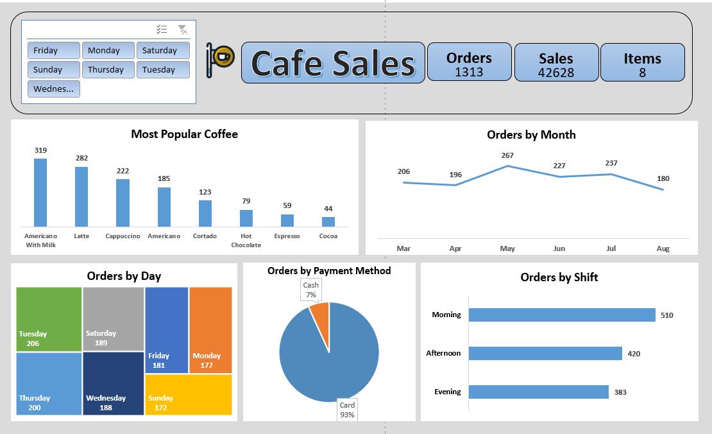
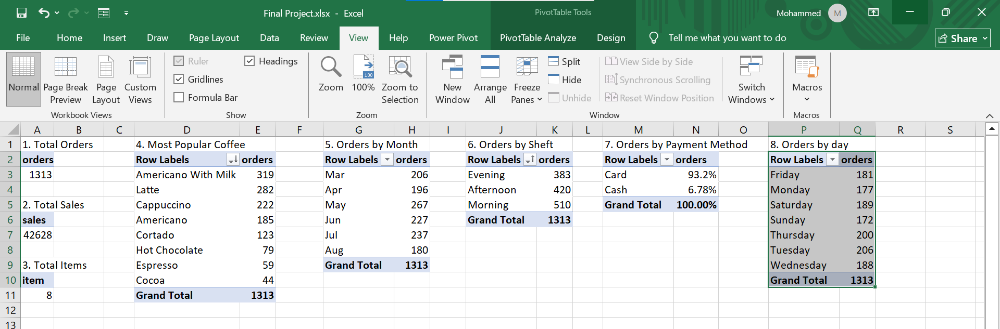

# ☕ Cafe Sales Dashboard  

## 👋 مقدمة | Introduction  
📊 مشروع عملي قمت بعمله باستخدام **Microsoft Excel** خلال 4 ساعات فقط.  
الهدف الأساسي كان:  
- التدريب على **Pivot Tables** & **Charts**.  
- تصميم **Dashboard تفاعلي** يعرض أهم المؤشرات.  
- استخراج **Insights** تساعد في اتخاذ قرارات عملية داخل الكافيه.  

---

## 🎯 أهداف المشروع | Project Goals  
✅ تحليل بيانات المبيعات اليومية والشهرية.  
✅ التعرف على أنماط الشراء حسب الأيام، الشهور، والورديات (Shifts).  
✅ تقييم طرق الدفع (Cash 💵 vs. Card 💳).  
✅ تحديد المشروبات الأكثر والأقل شعبية.  
✅ الخروج باقتراحات عملية لتطوير المبيعات.  

---

## 🔍 أهم النتائج | Key Insights  

- ⏰ أعلى وردية: **Morning Shift** بعدد (510 طلب).  
- 📅 أكثر الأيام في الطلبات: **الثلاثاء (206)** و **الخميس (200)**، بينما أقل يوم: **الأحد (172)**.  
- 💳 طرق الدفع: **Card 93%** مقابل **Cash 7%** → فرصة لتشجيع الدفع الكاش بخصومات.  
- ☕ المشروب الأكثر مبيعًا: **Americano with Milk – 319 طلب**، بينما الأقل: **Cocoa – 44 طلب**.  
- 📆 المبيعات الشهرية: الأعلى في **مايو (267)** والأقل في **أغسطس (180)**.  

---

## 💡 مقترحات بناءً على التحليل | Recommendations  
- 📌 زيادة عدد العمال في **Morning Shift** وأيام الذروة.  
- 📌 عمل عروض أو Bundles على المشروبات الأقل مبيعًا لزيادة الإقبال عليها.  
- 📌 تشجيع الدفع الكاش بخصومات صغيرة لتقليل رسوم الفيزا.  
- 📌 تقليل المخزون في الشهور منخفضة المبيعات (زي أغسطس) لتقليل الفاقد.  

---

## 🛠️ الأدوات المستخدمة | Tools Used  
- **Microsoft Excel**  
- Pivot Tables  
- Pivot Charts  
- Dashboard Design  

---

## 📷 صور المشروع | Screenshots  
### 🖥️ Dashboard  
  

### 📑 Pivot Tables  
  

---

## 📂 هيكل المشروع | Project Structure  
---

- **data/** 📊 → يحتوي على ملف البيانات (Excel).  
- **screenshots/** 🖼️ → لقطات شاشة من الـ Dashboard والـ Pivot Tables.  
- **README.md** 📄 → ملف التوثيق الخاص بالمشروع.
- 
---

---

## 📌 الخلاصة | Conclusion  
🚀 المشروع وضّح إزاي ممكن استخدام **Excel** في استخراج Insights عملية لأي نشاط تجاري صغير:  
- إدارة الموارد البشرية 👥  
- تنظيم المخزون 📦  
- تحسين المبيعات والعروض 🎯  

✨ لو شايف إن المشروع مفيد، دعمك بـ ⭐ على الريبو هيفرق معايا جدًا!  
